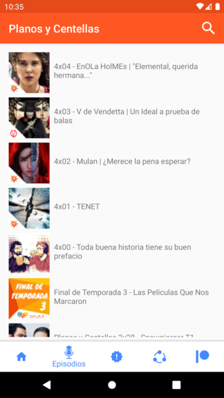
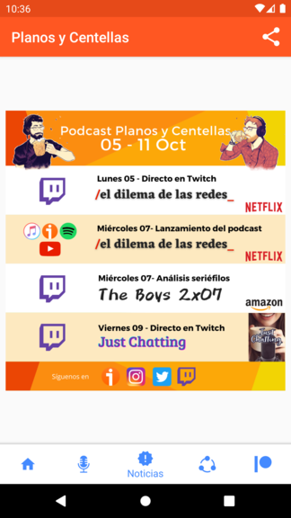
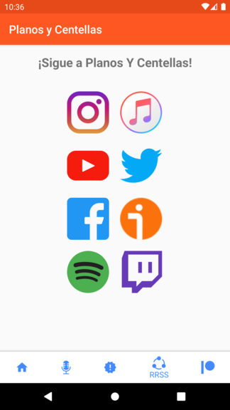

# Planos y Centellas

Planos y Centellas is a podcast about movies and series by Juan Hernandez y Manu Vacas. You can find more information about it in its [Ivoox webpage](https://www.ivoox.com/podcast-planos-centellas_sq_f1609149_1.html).

The purpose of this application is to gather all the relevant information about this podcast in the same place.

## Application description

The application contains 5 different sections for the user to explore:

* Home
* Episodes
* News
* Social Networks
* Patreon

### Home

Here general information about Planos y Centellas is presented to the user as a welcome screen.

### Episodes

A list with the episodes published by Planos y Centellas in Ivoox. If the user clicks on one, the Ivoox app will be launched to listen the desired episode.

### Upcoming

In this section, the user will see the upcoming episodes for the current week

### Social Networks

Contains all the Planos y Centellas social networks, go ahead and subscribe to not miss anything!

Click for open the corresponding social network and long click to share it with your friends!

### Patreon

In this section, the awards of being a patreon member and displayed. It also bring the posibility to the user to go to Patreon.com and become one!

## Application tecnical details

In this section the tecnical details about the app are going to be discussed.

### Architecture

The application contains 1 activity and some fragments, following the single Activity pattern. For the app navigation the Navigation Component is used.

The architecture selected is Model-View-ViewModel (MVVM). There is a ViewModel (HomeViewModel) instance shared by all the Fragments. This ViewModel uses a Repository class (Repository) to obtain the data. Equally, the Repository class uses a Provider class in order to achieve the required data.

This is a clear implementation of the MVVM patter as it can be seeing [here](https://developer.android.com/jetpack/guide)

Dagger2 is used for depdency injection.

### Data

The data is obtained when the user starts the application. Currently is not possible to update the data when the app is running, this may change in the future.

In order to obtain the data, web scrapping is performed in different webpages. For this purpose, some model classes have been created (see model package). Jsoup is the library used for the scrapping.

### Screenshots

 
 

### Libraries

* [Navigation Component](https://developer.android.com/guide/navigation/navigation-getting-started)
* [Dagger] (https://github.com/google/dagger)
* [Mockito] (https://github.com/mockito/mockito)
* [Coroutines] ()
* [Jsoup](https://jsoup.org/)
* [Picasso](https://github.com/square/picasso)
* [TouchImageView](https://github.com/MikeOrtiz/TouchImageView)
* [LeakCanary](https://github.com/square/leakcanary)

## External resources

* Youtube logo made by [Freepik](http://www.freepik.com/) in [Flaticon](https://www.flaticon.com/)

* Instagram logo made by [Freepik](http://www.freepik.com/) in [Flaticon](https://www.flaticon.com/)

* Spotify logo made by [Pixel perfect](https://www.flaticon.com/authors/pixel-perfect/) in [Flaticon](https://www.flaticon.com/)

* Patreon logo made by [Pixel perfect](https://www.flaticon.com/authors/pixel-perfect/) in [Flaticon](https://www.flaticon.com/)

* Twitter logo made by [Pixel perfect](https://www.flaticon.com/authors/pixel-perfect/) in [Flaticon](https://www.flaticon.com/)

* Facebook logo made by [Pixel perfect](https://www.flaticon.com/authors/pixel-perfect/) in [Flaticon](https://www.flaticon.com/)

* Gmail logo made by [Pixel perfect](https://www.flaticon.com/authors/pixel-perfect/) in [Flaticon](https://www.flaticon.com/)

* Microphone logo made by [Pixel perfect](https://www.flaticon.com/authors/pixel-perfect/) in [Flaticon](https://www.flaticon.com/)

* Twitch logo made by [Pixel perfect](https://www.flaticon.com/authors/pixel-perfect/) in [Flaticon](https://www.flaticon.com/)

* Social Network logo made by [Vitaly Gorbachev](https://www.flaticon.com/free-icon/share_2301269?term=social%20network&page=7&position=88) in [Flaticon](https://www.flaticon.com/)

* Itunes logo obatined from [here](https://upload.wikimedia.org/wikipedia/commons/d/df/ITunes_logo.svg)
  